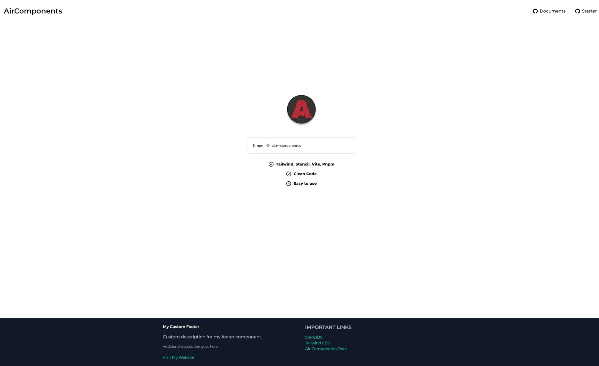

# AirComponents-Starter

Welcome to **AirComponents-Starter**! This is a lightweight and powerful starter template for building **Web Components** with **StencilJS** and **Tailwind CSS**, using **PNPM** as the package manager. It provides a smooth development experience with modern tooling and best practices. This project is designed to be **plug-and-play**, so you can start building your own components right away.

## Key Features

- **StencilJS**: Build fast, reusable, and native web components.
- **Tailwind CSS**: Utility-first CSS framework for highly customizable designs.
- **PNPM**: Efficient package manager for faster installs and less disk space usage.
- **Zero Configuration**: Out of the box support for developing and building web components.
- **Responsive Components**: Ready-to-use responsive components using Tailwind's utility classes.
- **Storybook**: Interactive UI playground for your components.



## Project Setup

This project is designed for easy setup with **StencilJS** and **Tailwind CSS**. You can start building your components right away without needing to configure anything!

### Prerequisites

Before you begin, ensure that you have the following installed:

- **Node.js** (>= 14.x)
- **PNPM** (you can install it globally with `npm install -g pnpm`)

### Installation

Clone this repository and install the dependencies using PNPM:

```bash
git clone https://github.com/SisyphusZheng/air-components-starter.git
cd air-components-starter
pnpm install
